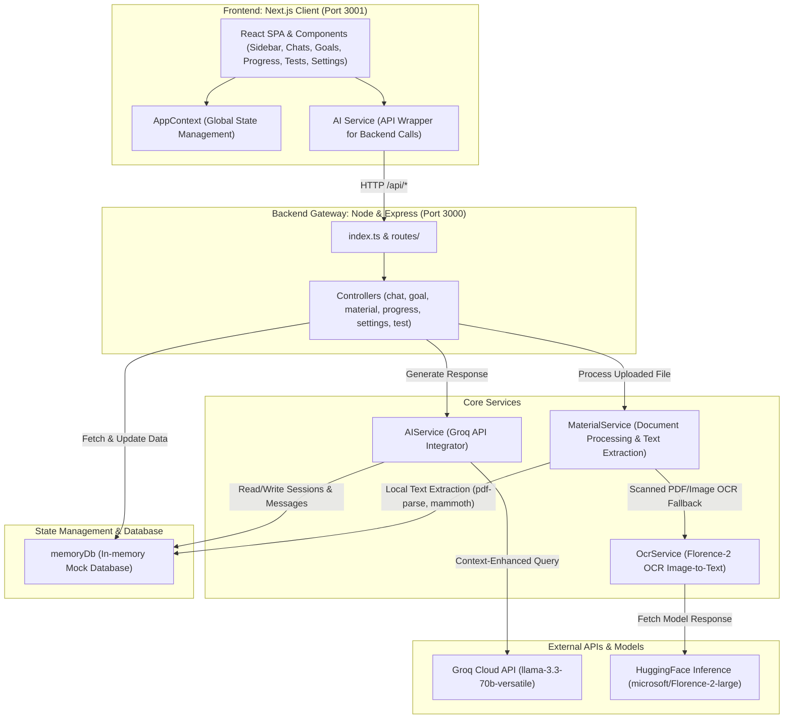
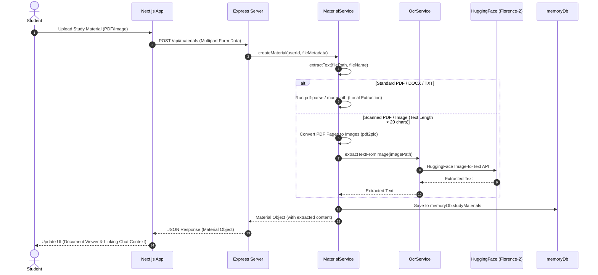

# EduGenie AI — System Architecture

This document describes the high-level system architecture, module relationships, and data pipelines for **EduGenie AI**.

---

## 🏗️ High-Level System Architecture

EduGenie AI is divided into a client frontend application, a backend API gateway server, local text parsing modules, and external API providers.



---

## 🔄 Core Sequences & Pipelines

### 📁 Document Processing & OCR Pipeline
The document ingestion flow determines the best text extraction tool depending on the file format and structure:



---

## 🗄️ In-Memory Database Schema (`memoryDb`)

The system manages state using a lightweight in-memory array database structured as follows:

```typescript
export const memoryDb = {
  users: [] as User[],
  settings: [] as Setting[],
  chatSessions: [] as ChatSession[],
  messages: [] as Message[],
  studyGoals: [] as StudyGoal[],
  progressTrackers: [] as ProgressTracker[],
  studySessions: [] as StudySession[],
  analytics: [] as Analytic[],
  practiceTests: [] as PracticeTest[],
  studyMaterials: [] as StudyMaterial[]
};
```

### Key Schema Types

#### 1. `StudyMaterial`
*   `id`: `string`
*   `userId`: `string`
*   `fileName`: `string`
*   `filePath`: `string`
*   `chatSessionId`: `string | null`
*   `content`: `string`
*   `extractionStatus`: `"SUCCESS" | "FAILED_OR_EMPTY"`
*   `size`: `number`
*   `mimeType`: `string`
*   `extractedTextLength`: `number`
*   `createdAt`: `Date`

#### 2. `ChatSession`
*   `id`: `string`
*   `userId`: `string`
*   `title`: `string`
*   `messages`: `Message[]`
*   `createdAt`: `Date`

#### 3. `Message`
*   `id`: `string`
*   `chatSessionId`: `string`
*   `role`: `"user" | "ai" | "system"`
*   `content`: `string`
*   `createdAt`: `Date`

#### 4. `StudyGoal`
*   `id`: `string`
*   `userId`: `string`
*   `title`: `string`
*   `status`: `"PENDING" | "COMPLETED"`
*   `createdAt`: `Date`

---

## 🧩 Module Interaction Specifications

### 1. Client App Module (`frontend`)
*   **Context Layer**: Tracks student profiles and current workspace views.
*   **Service Layer**: Handles network logic for document uploads and chat queries.
*   **View Layer**: Exposes onboarding UI, interactive chat workspace, test runner, goals manager, and settings.

### 2. Controller Module (`backend/controllers`)
*   Provides route middleware endpoints for the router definitions.
*   Directly interacts with memory database objects and coordinates backend services.

### 3. Extraction Module (`backend/services/material.service`)
*   Leverages `mammoth` for Word documents.
*   Leverages `pdf-parse` for standard PDFs.
*   Uses `pdf2pic` to generate images from scanned PDF pages, routing them to the OCR module.

### 4. OCR Module (`backend/services/ocr.service`)
*   Wraps the Hugging Face Inference client.
*   Uses Microsoft's **Florence-2-large** model for text extraction from images.
