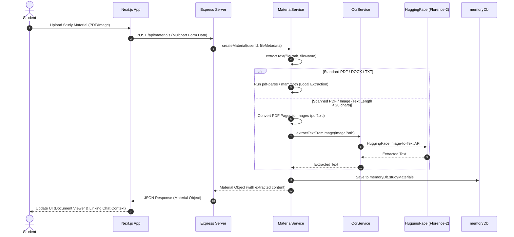

# EduGenie AI — System Design Specifications

This document outlines the detailed system design specifications, UI theme patterns, state management architecture, API interfaces, and AI/OCR pipelines for **EduGenie AI**.

---

## 🎨 UI & UX Design System

EduGenie AI uses a premium, dark-mode, glassmorphic design system that aligns with high-end modern SaaS aesthetics.

### 🎨 Visual Theme Tokens

*   **Backgrounds**:
    *   Primary Background: `#141413` (rich deep dark coal)
    *   Card/Panel Background: `#1c1b1a` (slightly lighter graphite)
    *   Header Background: `#2D2C2A` with `backdrop-filter: blur(12px)`
*   **Borders**:
    *   Primary Separators: `#3d3b38` (warm charcoal)
    *   Active/Glow Borders: `#4a4845`
*   **Color Accents (Harmonious Golds & Ambers)**:
    *   Primary gold-amber accent: `#D4AF37`
    *   Gold Hover: `#FFDF73`
    *   Primary highlights: `#primary-400` / `#primary-500`
*   **Typography**:
    *   Modern geometric sans-serif (e.g., Geist or Inter)
    *   Subtle spacing tracking tweaks for a clean, editorial look
*   **Visual Enhancements**:
    *   **Glassmorphism**: Combination of translucent backgrounds, thin borders, and backdrop-filter blur.
    *   **Luxury Cards**: Custom CSS styles (`luxury-card`) featuring soft gold/amber box shadows.
    *   **Gold Gradient Texts**: Custom gold gradient mask styling (`gold-gradient-text`) for headlines.

### 🧩 Core Frontend Page Layout

```
+-----------------------------------------------------------------------------+
|                                                                             |
|  [Logo] EduGenie AI                                                         |
|                                                                             |
|  +-------------------+  +--------------------------------+  +------------+  |
|  |                   |  | Active Chat Title             |  | Document   |  |
|  |  [+] New Chat     |  |                                |  | Viewer     |  |
|  |                   |  | +----------------------------+ |  |            |  |
|  |  * Chats          |  | | Chat Messages List         | |  | [Upload]   |  |
|  |  * Study Goals    |  | |                            | |  |            |  |
|  |  * Progress       |  | | - User: Doubt?             | |  | [Status]   |  |
|  |                   |  | | - AI: Explanation...       | |  |            |  |
|  |  Recent Sessions: |  | +----------------------------+ |  | Text       |  |
|  |  - Session 1      |  |                                |  | Content    |  |
|  |  - Session 2      |  | +----------------------------+ |  | Preview    |  |
|  |                   |  | | [Enter Message...    ] [>] | |  |            |  |
|  |  [Practice Test]  |  | +----------------------------+ |  |            |  |
|  +-------------------+  +--------------------------------+  +------------+  |
|      Sidebar (256px)               Main Workspace (Flex-1)    Doc Panel (25%)|
+-----------------------------------------------------------------------------+
```

---

## 🗄️ State Management Architecture

Global state is managed using React Context via the [AppContext](file:///c:/Users/Saravanan/Desktop/Interain%20AI/dhanusha-pritika-project/frontend/src/context/AppContext.tsx) provider.

### Key State Properties
*   `studentData`: Stores profile information entered during onboarding (Name, Grade, Subject, Goal, Initial Question).
*   `activeView`: Controls the visible panel in the main workspace (`chat`, `goals`, `progress`, `practice`, `settings`).
*   `chats`: List of active and archived chat sessions with nested messages arrays.
*   `activeChatId`: References the currently selected chat session.
*   `isUploaded` / `isLoaded`: Flags determining status of document uploads and app initialization state.

---

## ⚙️ Backend Services

### 📄 Document Extraction & OCR Pipeline
The backend handles document ingestion using a tiered fallback strategy:

1.  **File Ingestion**: Multer processes multipart form uploads and saves files under `backend/public/uploads/`.
2.  **Mime-Type Dispatching**:
    *   **PDF**: Parsed locally with `pdf-parse`.
    *   **DOCX/DOC**: Parsed locally with `mammoth`.
    *   **TXT/Plain Text**: Read directly.
    *   **PNG/JPG/JPEG**: Dispatched directly to Florence-2 OCR.
3.  **Scanned PDF Fallback**: If the local PDF parsing outputs under 20 characters (a common indicator of scanned/image-only PDFs), `MaterialService` triggers an OCR extraction fallback:
    *   Uses `pdf2pic` to render the first 3 pages of the PDF as temporary PNGs.
    *   Invokes `OcrService` to process each page image using Microsoft's **Florence-2-large** model on HuggingFace Inference.
    *   Aggregates the extracted text, saves it, and cleans up temporary image outputs.

### 🤖 AI Tutoring (Groq Integration)
*   **Model**: `llama-3.3-70b-versatile`
*   **System Persona**: EduGenie, an expert educational AI assistant designed to provide patient, clear, and comprehensive explanations.
*   **Context Linking**: When a chat is linked to a document, the chat router fetches the text content from `memoryDb` and appends it to the model prompt as a reference context window, allowing document-specific Q&A.

---

## 🔌 API Gateway Specifications

All endpoints are hosted under `/api`.

### 💬 Chat Endpoints
*   `GET /api/chats`: Retrieve all chat sessions.
*   `POST /api/chats`: Create a new chat session.
*   `GET /api/chats/:id`: Retrieve chat session details.
*   `POST /api/chats/:id/messages`: Add a user message and trigger the AI generation pipeline.
*   `POST /api/chat`: Send a direct prompt (independent chat node).

### 🎯 Study Goals Endpoints
*   `GET /api/goals`: Retrieve student study goals.
*   `POST /api/goals`: Create a new study goal.
*   `PUT /api/goals/:id`: Update an existing goal status or title.

### 📝 practice Tests Endpoints
*   `GET /api/tests`: Get generated test results.
*   `POST /api/tests`: Generate a new practice test.
*   `POST /api/tests/:id/evaluate`: Evaluate student answers against test answers.

### 📂 Materials (Uploads)
*   `GET /api/materials`: Fetch all uploaded documents.
*   `POST /api/materials`: Upload a document file (supports image, PDF, DOCX, TXT). Uses Multer multipart storage.

---

## 🔄 Core Data Flow Sequence


