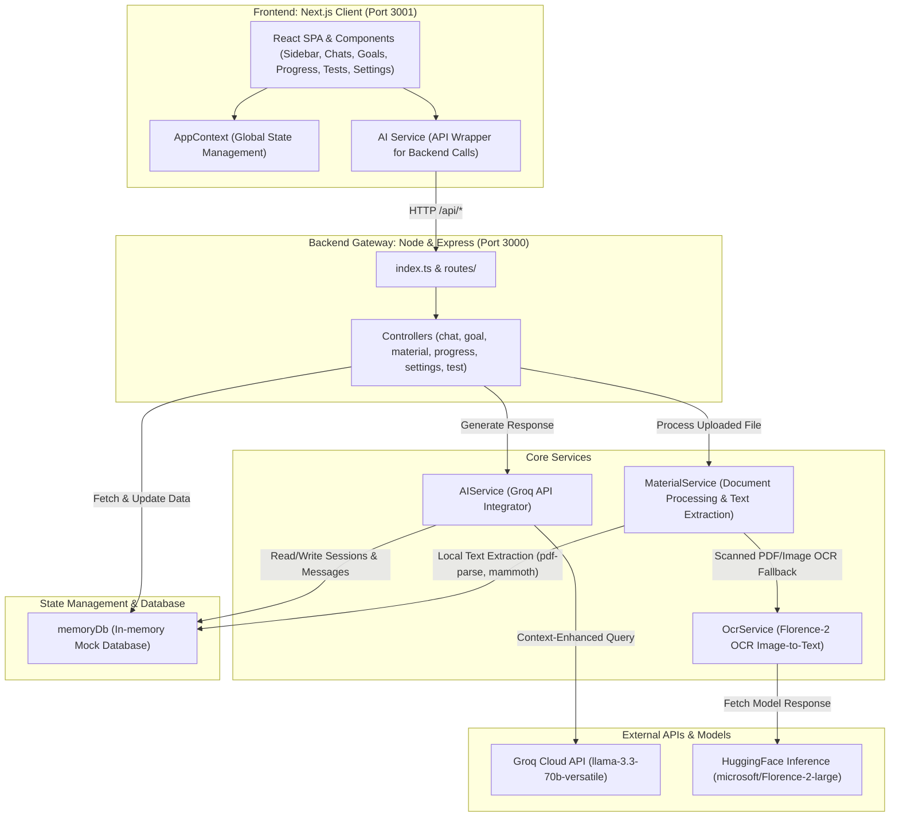

# EduGenie AI — AI-Powered Study Application

Welcome to **EduGenie AI**, a premium, feature-rich study application designed to personalize and elevate the learning experience. EduGenie provides an interactive learning companion that links uploaded study documents (PDFs, Word documents, images, and text files) with advanced LLM tutoring, study planning, practice tests, and progress tracking.

---

## 🗺️ System Architecture

EduGenie is structured as a decoupled full-stack application. It combines a responsive, modern Next.js client with a Node.js Express API server.

### 🌐 System Architecture Diagram



---

## ✨ Key Features

1. **AI Chat Companion (EduGenie)**: Interactive learning partner powered by `llama-3.3-70b-versatile` through Groq.
2. **Contextual Document Learning**: Upload text, images, Word files, or PDFs. The chatbot uses extracted document contents to answer questions contextually.
3. **Smart Text Extraction & OCR Fallback**:
   - Extraction of native PDFs, Word documents (`.docx`), and text.
   - Intelligent OCR fallback for images and scanned (image-only) PDFs using the **Florence-2** model (`microsoft/Florence-2-large`) via the HuggingFace Inference API.
4. **Cinematic Onboarding**: Aesthetic entry flow where students define their name, subject, target grade, and specific learning objectives.
5. **Study Goals & Objectives Tracker**: Create, track, and update customized learning milestones.
6. **Practice Tests & Feedback**: Generate custom practice tests based on current topics and evaluate student responses with scoring and explanation feedback.
7. **Detailed Progress Analytics**: Visualized trackers showing study completion rates and historical progress.

---

## 🛠️ Technology Stack

| Layer | Technologies & Libraries |
| :--- | :--- |
| **Frontend** | React, Next.js (App Router), TypeScript, Tailwind CSS, Lucide React icons |
| **Backend** | Node.js, Express, Multer, TypeScript, pdf-parse, mammoth, pdf2pic |
| **Database** | Lightweight In-Memory database (`memoryDb`) tracking user profiles, chat history, goals, and analytics |
| **AI Integration** | `groq-sdk` (Llama 3.3 model), `@huggingface/inference` (Florence-2-large model) |

---

## 📦 Directory Structure

```
dhanusha-pritika-project/
├── backend/                  # Node.js + Express Backend Server
│   ├── src/
│   │   ├── config/           # Database configurations (in-memory db)
│   │   ├── controllers/      # Route request/response handlers
│   │   ├── lib/              # Helper utilities & third-party API providers
│   │   ├── middleware/       # Express error and route logging middlewares
│   │   ├── routes/           # API endpoints routing definitions
│   │   └── services/         # OCR, AI, document text-extraction, and business logic
│   ├── package.json
│   └── tsconfig.json
├── frontend/                 # Next.js Frontend Client
│   ├── src/
│   │   ├── app/              # Page components & app routes
│   │   ├── components/       # Reusable React UI components
│   │   ├── context/          # React Global App Context
│   │   └── services/         # Client-side API fetch services
│   ├── package.json
│   └── tsconfig.json
└── README.md                 # Primary Workspace Documentation
```

---

## 🚀 Getting Started

### 📋 Prerequisites
- **Node.js** (v18.x or above recommended)
- **Groq API Key**: For chat and assessment capabilities.
- **HuggingFace API Key**: For Florence-2 OCR image-to-text conversion.

### 🔑 Environment Configuration
Create a `.env` file in the `backend/` directory:

```env
PORT=3000
GROK_API_KEY=your_groq_api_key_here
HUGGINGFACE_API_KEY=your_huggingface_api_key_here
```

> [!NOTE]
> Ensure the frontend is configured to communicate with the backend. By default, the frontend will connect to `http://localhost:3000/api`.

### 💻 Installation & Running

1. **Run Backend**:
   ```bash
   cd backend
   npm install
   npm run dev
   ```
   The backend server starts on `http://localhost:3000`.

2. **Run Frontend**:
   ```bash
   cd ../frontend
   npm install
   npm run dev
   ```
   The Next.js dev server starts on `http://localhost:3001` (or next available port). Open [http://localhost:3001](http://localhost:3001) in your browser.

---

## 📄 Documentation Links
- [Root Design Specifications (DESIGN.md)](file:///c:/Users/Saravanan/Desktop/Interain%20AI/dhanusha-pritika-project/DESIGN.md)
- [Detailed System Architecture (ARCHITECTURE.md)](file:///c:/Users/Saravanan/Desktop/Interain%20AI/dhanusha-pritika-project/ARCHITECTURE.md)
